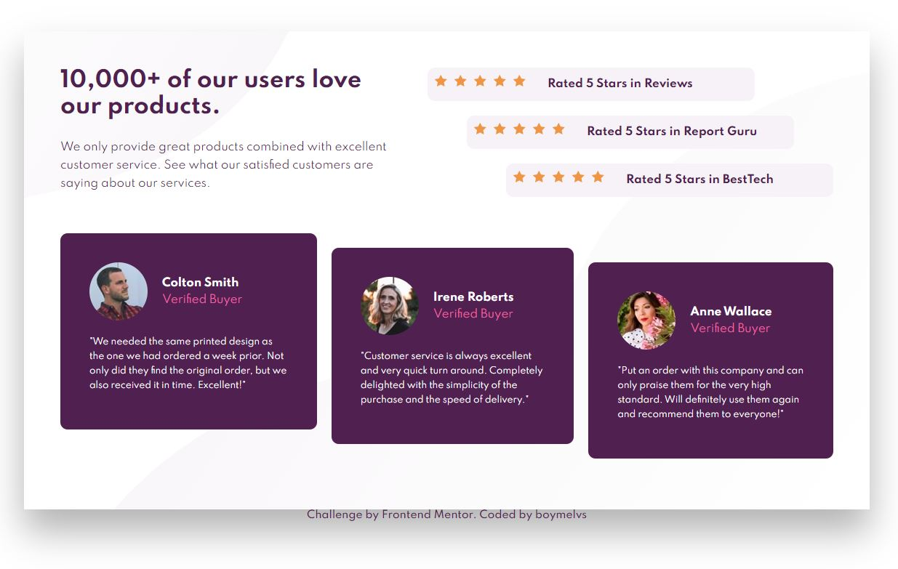

# Frontend Mentor - SOCIAL PROOF SECTION SOLUTION

## Table of contents

- [Overview](#overview)
  - [The challenge](#the-challenge)
  - [Screenshot](#screenshot)
  - [Links](#links)
  - [Built with](#built-with)
- [Author](#author)

## Welcome! 👋

Thanks for checking out this front-end coding challenge.

## Overview

This is a solution to the [Social proof section challenge on Frontend Mentor](https://www.frontendmentor.io/challenges/social-proof-section-6e0qTv_bA).

### The challenge

Users should be able to:

- Design Social proof section
- View the optimal layout for the component depending on their device's screen size

### Screenshot

### Links

- Live Site URL: [Live site](https://boymelvs.github.io/SOCIAL-PROOF-SECTION-MASTER/)

### Built with

- HTML
- Flexbox
- CSS

## Author

- Frontend Mentor - [Melvin](https://www.frontendmentor.io/profile/boymelvs)
